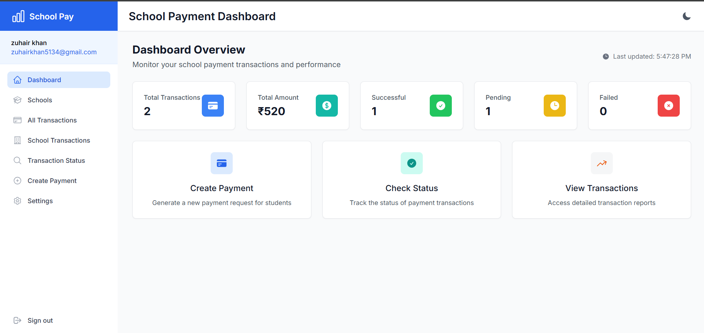
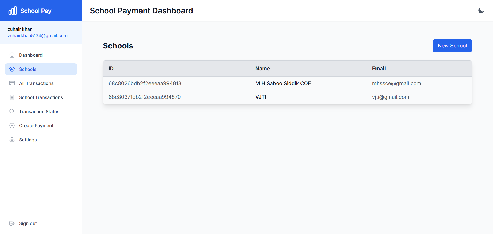
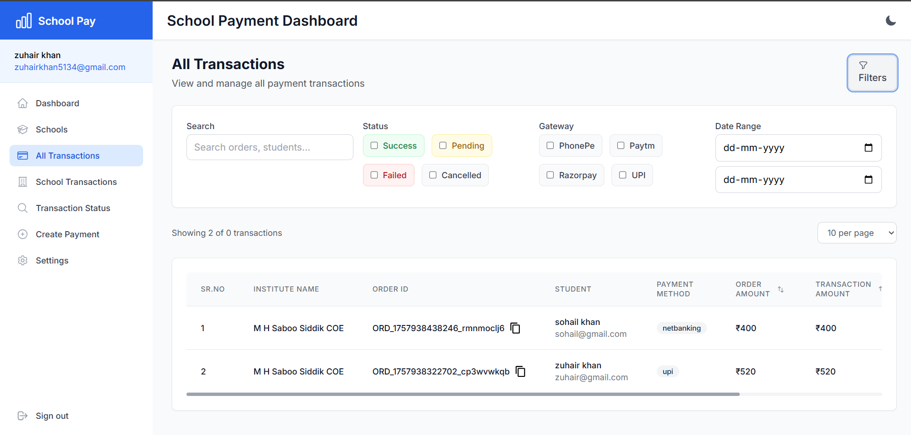
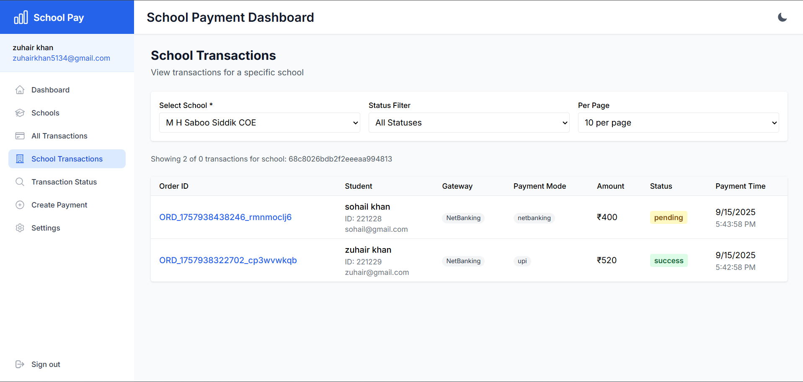
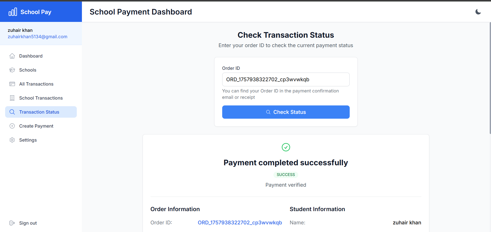
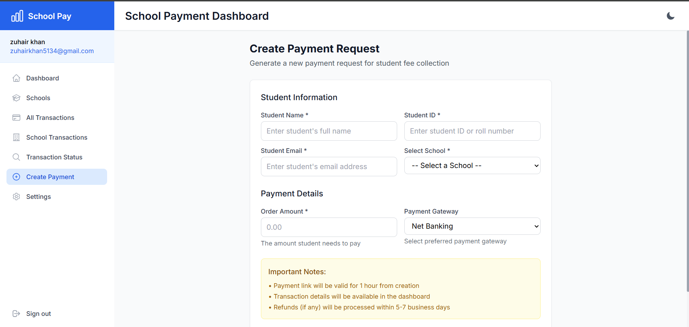

# Frontend
````markdown
# 🎓 School Payment & Dashboard Frontend

---

## 📌 Project Overview
This is the **frontend application** for the School Payment & Dashboard project.
It is built with **React + TypeScript** and styled using **Tailwind CSS**.

---

## 🚀 Setup Instructions

### 1. Clone the repository
```bash
git clone https://github.com/beingzuhairkhan/payment.git
cd frontend
````

### 2. Install dependencies

```bash
npm install
```

### 3. Create environment file

Create a `.env` file in the root folder and add:

```env
VITE_API_URL=http://localhost:5000/api
```

### 4. Run the development server

```bash
npm run dev
```

The app will be available at:

```
http://localhost:5173
```

---

## 📄 Pages & Features

* **Dashboard** → Summary of transactions and payments
* **Schools** → Add, list, and manage schools
* **Orders** → View and track payment orders
* **Users** → Manage trustees and students

---

## 📸 Screenshots

DashBoard 


School


All Transactions


School Transactions


Transactions Status


Create Payment


setting


# Backend

Baceknd_URL = https://payment-8a95.onrender.com

---

````markdown
# 💳 School Payment & Dashboard Backend

## 📌 Overview
This is the backend for the School Payment & Dashboard project.  
It is built with **Node.js, Express, and MongoDB**.

---

## 🚀 Setup

1. Clone the repo
```bash
git clone https://github.com/beingzuhairkhan/payment.git
cd backend
````

2. Install dependencies

```bash
npm install
```

3. Create `.env` file

```env
PORT=5000
MONGODB_URI=mongodb://localhost:27017/school-dashboard
JWT_SECRET=your_jwt_secret
JWT_EXPIRY='1h'
PG_SECRET=secret_key
PG_API_KEY=api_key
EDVIRON_SCHOOL_ID=edviron_school_id
FRONTEND_URL=http://localhost:5173
```

4. Run server

```bash
npm run dev
```

Server will run at:

```
http://localhost:5000
```

---

## 📄 API Endpoints

### User

* `POST /user/register` → Register
* `POST /user/login` → Login
* `GET /user/me` → Get current user
* `POST /user/refresh` → Refresh token

### School

* `POST /school` → Create school
* `GET /school` → Get all schools

### Order

* `POST /order/create-payment` → Create payment
* `GET /order/verify-payment` → Verify payment

### Transaction

* `GET /transaction` → Get all transactions
* `GET /transaction/status/:order_id` → Transaction by order ID
* `GET /transaction/school/:schoolId` → Transactions by school
* `GET /transaction/overview` → Dashboard overview

---

